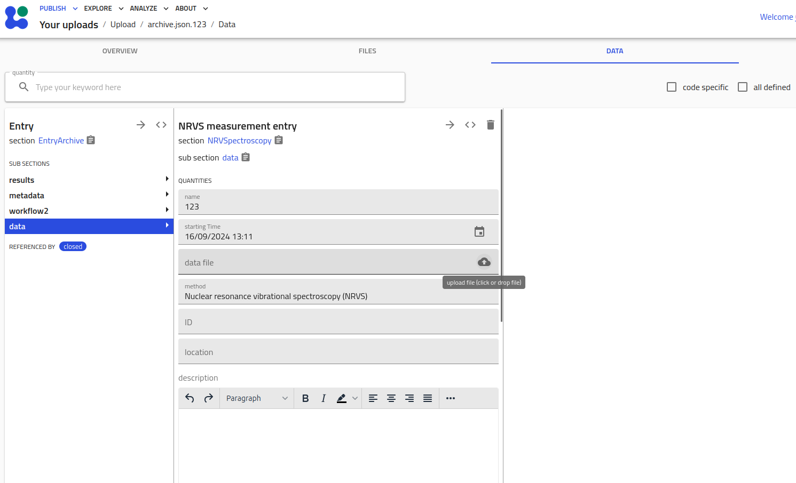
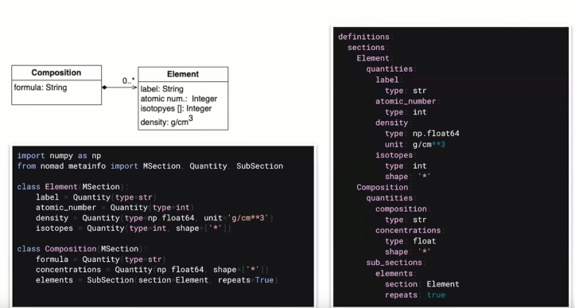
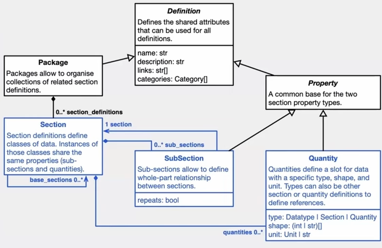

# General NOMAD concepts 
This information is based on the FAIRmat Tutorial 12 (https://www.youtube.com/watch?v=mc5kZjeF7KU).

## How to add a data entry in NOMAD

There are two ways how to add a data entry in NOMAD:

Option 1 is that the user uploads an archive with raw data.
A suitable parser is automatically assigned depending on the raw data structure (“matching”). The actual result data is automatically processed from the raw data (“parsing”). 
The result data is processed automatically (“normalizing”). This option is useful when the data from the experiment or simulation needs to be formatted or for generating plots.

Option 2 is that the user fils meta-data into an input mask. The user uploads result data (no raw data!!!). 
The result data can be processed automatically to extract meta data (“normalizing”).

| Option           | Raw data                | Result data                                                       | Meta data                                                                                                     |
|------------------|-------------------------|-------------------------------------------------------------------|---------------------------------------------------------------------------------------------------------------|
| 1 Archive upload | is provided by the user | is generated automatically from the raw data (requires: a parser) | is extracted automatically from the processed data  (requires: a normalizer)                                  |
| 2 Schema usage   | -                       | is provided by the user                                           | is provided by the USER   AND/OR  is extracted automatically from the processed data (requires: a normalizer) |

### Option 1: adding a data entry using a schema 

The user selects a schema over the webinterface. The user fill the input mask with data and meta-data. If the schema contains a normalizer meta-data is automatically generated from the user input when saving the  user input.

Schemas are available as "built-in schema" on the web-interface. Here is an example schema ("XRay Diffraction"):

The experimental data is added directly in the data entry. When clicking "save" the data is further processed if there is a normalizer attached to the schema:

### Option 2: adding a data entry using a parser

The user provides a data archive

Important: the normalizer is executed after the parsing process: 

## Schemas
Schemas define the structure of data:

### How to define schemas

Schemas can be specified as *.yaml file OR as Python class. We use Python classes.
In Python a schema is defined by implementing the MSection interface:

NOMAD provides interfaces for schemas for empirical data and simulation data.

We implement these interfaces for pedestrian dynamics specific applications:
- empirical research: laboratory experiments, field observations
- simulation studies: conducted with the Optimal Steps Model, conducted with the Social Force Model, ... 

Some images are snapshots from FAIRmat Tutorial 12 (https://www.youtube.com/watch?v=mc5kZjeF7KU)
